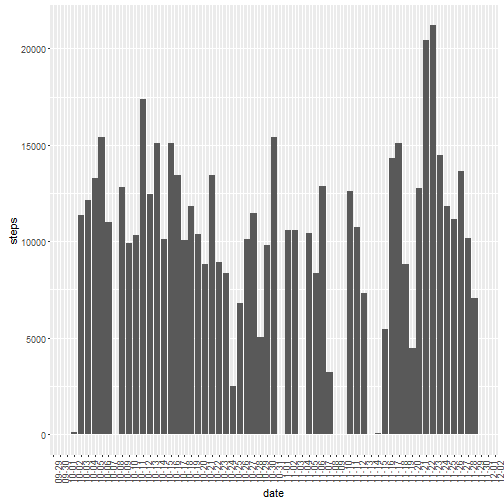
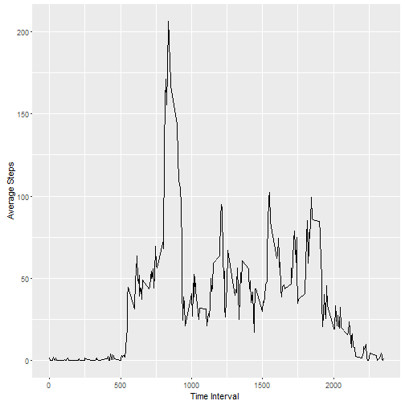
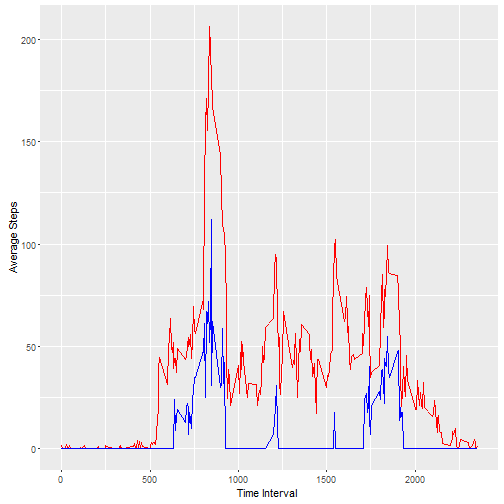
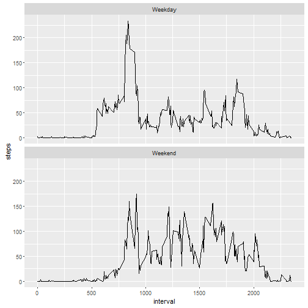

---
#title: "PA1_template"
#author: "Scott Ziemke"
#date: "February 9, 2016"
#output: html_document

***

##Introduction

It is now possible to collect a large amount of data about personal movement using activity monitoring devices such as a Fitbit, Nike Fuelband, or Jawbone Up. These type of devices are part of the "quantified self" movement - a group of enthusiasts who take measurements about themselves regularly to improve their health, to find patterns in their behavior, or because they are tech geeks. But these data remain under-utilized both because the raw data are hard to obtain and there is a lack of statistical methods and software for processing and interpreting the data.

This assignment makes use of data (found here:  <https://d396qusza40orc.cloudfront.net/repdata%2Fdata%2Factivity.zip>) from a personal activity monitoring device. This device collects data at 5 minute intervals through out the day. The data consists of two months of data from an anonymous individual collected during the months of October and November, 2012 and include the number of steps taken in 5 minute intervals each day (NAs included). 

***
##Assignment Structure

This assignment is broken down and answered by 5 Major components:
1. Loading and preprocessing the data
2. What is mean total number of steps taken per day?
3. What is the average daily activity pattern?
4. Imputing missing values
5. Are there differences in activity patterns between weekdays and weekends?

***

##Assignment Content

##1. Loading and preprocessing the data

The data consists of only 1 file titled "activity.csv. Load the data using the following r script:


```r
data_raw <- as.data.frame(read.csv("activity.csv", sep = ","))
```

Load required librarys:


```r
library(ggplot2)
library(scales)
library(plyr)
```


Lets first take a look at the contents of the data before we perform any manipulations.  This can be done by


```r
summary(data_raw)
```

```
##      steps                date          interval     
##  Min.   :  0.00   2012-10-01:  288   Min.   :   0.0  
##  1st Qu.:  0.00   2012-10-02:  288   1st Qu.: 588.8  
##  Median :  0.00   2012-10-03:  288   Median :1177.5  
##  Mean   : 37.38   2012-10-04:  288   Mean   :1177.5  
##  3rd Qu.: 12.00   2012-10-05:  288   3rd Qu.:1766.2  
##  Max.   :806.00   2012-10-06:  288   Max.   :2355.0  
##  NA's   :2304     (Other)   :15840
```

The variables included in this dataset are:

steps: Number of steps taking in a 5-minute interval (missing values are coded as NA)
date: The date on which the measurement was taken in YYYY-MM-DD format
interval: Identifier for the 5-minute interval in which measurement was taken

There are a total of 17,568 observations in this dataset. 

```r
nrow(data)
```

```
## [1] 15264
```

In order to format the variable "date" as time series element, some manipulation must be done:

```r
data_raw$date <- as.Date(data_raw$date, format = "%Y-%m-%d")
```

A new data set will be created with NAs omitted

```r
data_filtered <- na.omit(data_raw)
```


##2. What is mean total number of steps taken per day?

The total, mean, and median number of steps per day is calculated:

```r
Totals <- cbind(with(data_raw, tapply(steps, date, sum)), 
      with(data_raw, tapply(steps, date, mean)), 
      with(data_raw, tapply(steps, date, median)))
colnames(Totals) <- c("sum", "mean", "median")
Totals
```

```
##              sum       mean median
## 2012-10-01    NA         NA     NA
## 2012-10-02   126  0.4375000      0
## 2012-10-03 11352 39.4166667      0
## 2012-10-04 12116 42.0694444      0
## 2012-10-05 13294 46.1597222      0
## 2012-10-06 15420 53.5416667      0
## 2012-10-07 11015 38.2465278      0
## 2012-10-08    NA         NA     NA
## 2012-10-09 12811 44.4826389      0
## 2012-10-10  9900 34.3750000      0
## 2012-10-11 10304 35.7777778      0
## 2012-10-12 17382 60.3541667      0
## 2012-10-13 12426 43.1458333      0
## 2012-10-14 15098 52.4236111      0
## 2012-10-15 10139 35.2048611      0
## 2012-10-16 15084 52.3750000      0
## 2012-10-17 13452 46.7083333      0
## 2012-10-18 10056 34.9166667      0
## 2012-10-19 11829 41.0729167      0
## 2012-10-20 10395 36.0937500      0
## 2012-10-21  8821 30.6284722      0
## 2012-10-22 13460 46.7361111      0
## 2012-10-23  8918 30.9652778      0
## 2012-10-24  8355 29.0104167      0
## 2012-10-25  2492  8.6527778      0
## 2012-10-26  6778 23.5347222      0
## 2012-10-27 10119 35.1354167      0
## 2012-10-28 11458 39.7847222      0
## 2012-10-29  5018 17.4236111      0
## 2012-10-30  9819 34.0937500      0
## 2012-10-31 15414 53.5208333      0
## 2012-11-01    NA         NA     NA
## 2012-11-02 10600 36.8055556      0
## 2012-11-03 10571 36.7048611      0
## 2012-11-04    NA         NA     NA
## 2012-11-05 10439 36.2465278      0
## 2012-11-06  8334 28.9375000      0
## 2012-11-07 12883 44.7326389      0
## 2012-11-08  3219 11.1770833      0
## 2012-11-09    NA         NA     NA
## 2012-11-10    NA         NA     NA
## 2012-11-11 12608 43.7777778      0
## 2012-11-12 10765 37.3784722      0
## 2012-11-13  7336 25.4722222      0
## 2012-11-14    NA         NA     NA
## 2012-11-15    41  0.1423611      0
## 2012-11-16  5441 18.8923611      0
## 2012-11-17 14339 49.7881944      0
## 2012-11-18 15110 52.4652778      0
## 2012-11-19  8841 30.6979167      0
## 2012-11-20  4472 15.5277778      0
## 2012-11-21 12787 44.3993056      0
## 2012-11-22 20427 70.9270833      0
## 2012-11-23 21194 73.5902778      0
## 2012-11-24 14478 50.2708333      0
## 2012-11-25 11834 41.0902778      0
## 2012-11-26 11162 38.7569444      0
## 2012-11-27 13646 47.3819444      0
## 2012-11-28 10183 35.3576389      0
## 2012-11-29  7047 24.4687500      0
## 2012-11-30    NA         NA     NA
```

Visually, we can see the total number of steps per day in a histogram:

```r
ggplot(data_filtered, aes(date, steps)) +
  stat_summary(fun.y = sum, geom = "bar")+ 
  scale_x_date(breaks=date_breaks(width="1 day"), labels = date_format("%m-%d"))+ 
  theme(axis.text.x=element_text(angle=90))
```



##3. What is the average daily activity pattern?

Visually, we can inspect the average number of steps per time interval, accross all days: 


```r
ggplot(data_filtered, aes(interval, steps)) +
  stat_summary(fun.y = mean, geom = "line")+ 
  xlab("Time Interval ") +          
  ylab("Average Steps")
```



To determine the interval with the maximum number of steps on average accross all days:


```r
Int_Table <- ddply(data_raw, .(interval), summarize, total_steps = sum(steps, na.rm = TRUE))
subset(Int_Table, Int_Table[,2]== max(Int_Table[,2]))
```

```
##     interval total_steps
## 104      835       10927
```

##4. Imputing missing values

As noted in the introduction, NAs are included in the "steps" variable.  The total number of entries with NA are:


```r
nrow(data_raw)-nrow(na.omit(data_raw))
```

```
## [1] 2304
```

In order to include the data set in the study, the entries with NAs were replaced with mean number of steps for their respective time interval, across all days. A new data set "data_replaced" is created:

```r
myFN <- function(x){mean(x, na.rm = TRUE)}
data_replaced <- data_raw
data_replaced$steps <- with(data_replaced, ifelse(is.na(steps)==TRUE, tapply(steps, interval, myFN),steps))
```

The mean and Median Steps are then plotted by time interval across all days:

```r
ggplot(data_replaced, aes(interval, steps)) +
  stat_summary(fun.y = mean, geom = "line", color = "red", aes(interval, steps, color = "mean"))+ 
  stat_summary(fun.y = median, geom = "line", color = "blue", aes(interval, steps, color = "median"))+
  xlab("Time Interval ") +          
  ylab("Average Steps") +
  scale_shape_manual("", values=c("mean"="x"))
```



Comparing the mean and median from the original data set "data_raw" to the new data set with NAs replaced "data_filtered", is is aparent that the mean and median are equal. 


```r
ifelse(with(data_replaced, tapply(steps, date, mean))-with(data_raw, tapply(steps, date, mean, na.rm = TRUE)) == 0  |
         is.na(with(data_replaced, tapply(steps, date, mean))-with(data_raw, tapply(steps, date, mean))) == TRUE,
       "Equal",
       "Not Equal")
```

```
## 2012-10-01 2012-10-02 2012-10-03 2012-10-04 2012-10-05 2012-10-06 
##    "Equal"    "Equal"    "Equal"    "Equal"    "Equal"    "Equal" 
## 2012-10-07 2012-10-08 2012-10-09 2012-10-10 2012-10-11 2012-10-12 
##    "Equal"    "Equal"    "Equal"    "Equal"    "Equal"    "Equal" 
## 2012-10-13 2012-10-14 2012-10-15 2012-10-16 2012-10-17 2012-10-18 
##    "Equal"    "Equal"    "Equal"    "Equal"    "Equal"    "Equal" 
## 2012-10-19 2012-10-20 2012-10-21 2012-10-22 2012-10-23 2012-10-24 
##    "Equal"    "Equal"    "Equal"    "Equal"    "Equal"    "Equal" 
## 2012-10-25 2012-10-26 2012-10-27 2012-10-28 2012-10-29 2012-10-30 
##    "Equal"    "Equal"    "Equal"    "Equal"    "Equal"    "Equal" 
## 2012-10-31 2012-11-01 2012-11-02 2012-11-03 2012-11-04 2012-11-05 
##    "Equal"    "Equal"    "Equal"    "Equal"    "Equal"    "Equal" 
## 2012-11-06 2012-11-07 2012-11-08 2012-11-09 2012-11-10 2012-11-11 
##    "Equal"    "Equal"    "Equal"    "Equal"    "Equal"    "Equal" 
## 2012-11-12 2012-11-13 2012-11-14 2012-11-15 2012-11-16 2012-11-17 
##    "Equal"    "Equal"    "Equal"    "Equal"    "Equal"    "Equal" 
## 2012-11-18 2012-11-19 2012-11-20 2012-11-21 2012-11-22 2012-11-23 
##    "Equal"    "Equal"    "Equal"    "Equal"    "Equal"    "Equal" 
## 2012-11-24 2012-11-25 2012-11-26 2012-11-27 2012-11-28 2012-11-29 
##    "Equal"    "Equal"    "Equal"    "Equal"    "Equal"    "Equal" 
## 2012-11-30 
##    "Equal"
```

```r
ifelse(with(data_replaced, tapply(steps, date, median))-with(data_raw, tapply(steps, date, median, na.rm = TRUE)) == 0  |
         is.na(with(data_replaced, tapply(steps, date, median))-with(data_raw, tapply(steps, date, median))) == TRUE,
       "Equal",
       "Not Equal")
```

```
## 2012-10-01 2012-10-02 2012-10-03 2012-10-04 2012-10-05 2012-10-06 
##    "Equal"    "Equal"    "Equal"    "Equal"    "Equal"    "Equal" 
## 2012-10-07 2012-10-08 2012-10-09 2012-10-10 2012-10-11 2012-10-12 
##    "Equal"    "Equal"    "Equal"    "Equal"    "Equal"    "Equal" 
## 2012-10-13 2012-10-14 2012-10-15 2012-10-16 2012-10-17 2012-10-18 
##    "Equal"    "Equal"    "Equal"    "Equal"    "Equal"    "Equal" 
## 2012-10-19 2012-10-20 2012-10-21 2012-10-22 2012-10-23 2012-10-24 
##    "Equal"    "Equal"    "Equal"    "Equal"    "Equal"    "Equal" 
## 2012-10-25 2012-10-26 2012-10-27 2012-10-28 2012-10-29 2012-10-30 
##    "Equal"    "Equal"    "Equal"    "Equal"    "Equal"    "Equal" 
## 2012-10-31 2012-11-01 2012-11-02 2012-11-03 2012-11-04 2012-11-05 
##    "Equal"    "Equal"    "Equal"    "Equal"    "Equal"    "Equal" 
## 2012-11-06 2012-11-07 2012-11-08 2012-11-09 2012-11-10 2012-11-11 
##    "Equal"    "Equal"    "Equal"    "Equal"    "Equal"    "Equal" 
## 2012-11-12 2012-11-13 2012-11-14 2012-11-15 2012-11-16 2012-11-17 
##    "Equal"    "Equal"    "Equal"    "Equal"    "Equal"    "Equal" 
## 2012-11-18 2012-11-19 2012-11-20 2012-11-21 2012-11-22 2012-11-23 
##    "Equal"    "Equal"    "Equal"    "Equal"    "Equal"    "Equal" 
## 2012-11-24 2012-11-25 2012-11-26 2012-11-27 2012-11-28 2012-11-29 
##    "Equal"    "Equal"    "Equal"    "Equal"    "Equal"    "Equal" 
## 2012-11-30 
##    "Equal"
```

##Are there differences in activity patterns between weekdays and weekends?

To evaluate wether or not weekdays vary from weekends, a new catagorical variable is created called "weekday"


```r
data_filtered$weekday <- ifelse(weekdays(data_filtered$date) == "Saturday" | weekdays(data_filtered$date) == "Sunday", "Weekend", "Weekday")
```

Next, it would be useful to visualize the average steps per interval, by weekend and weekday. 


```r
ggplot(data_filtered, aes(interval, steps))+
  stat_summary(fun.y = mean, geom = "line")+ 
  facet_wrap(~weekday, nrow=2)
```



